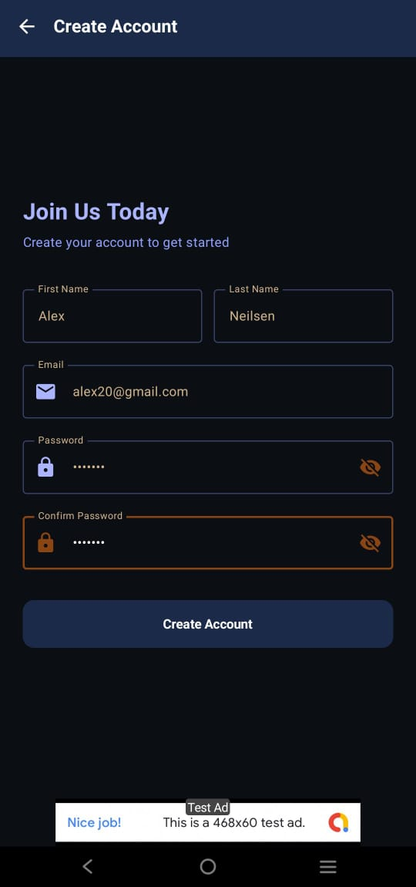
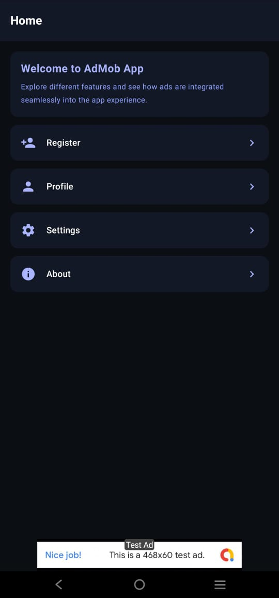
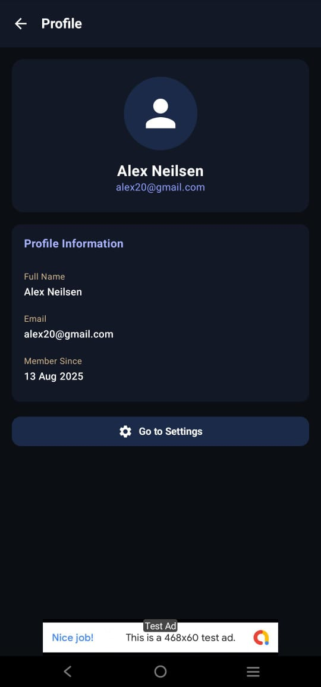
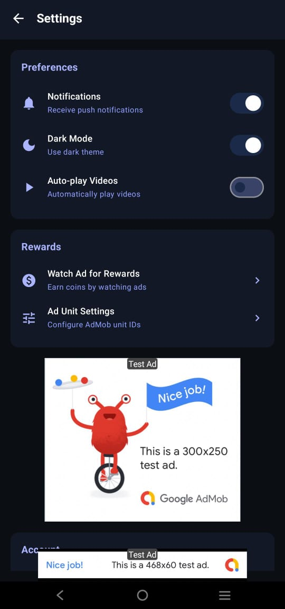
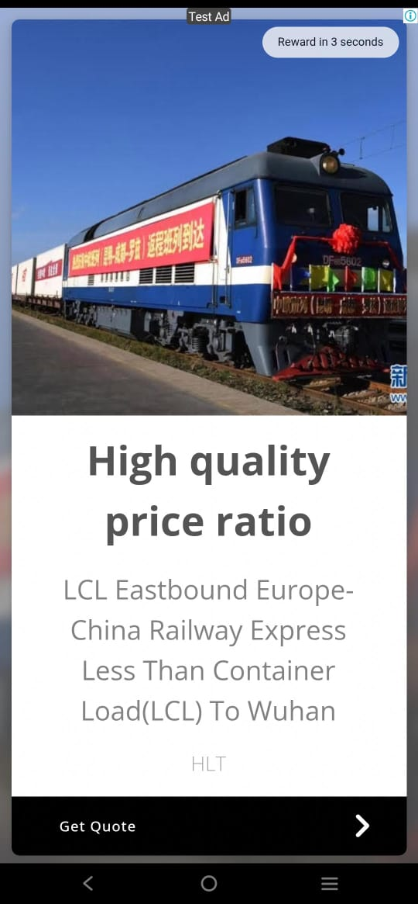

# 📱 AdMob App – Monetization with Firebase  
**"Monetize smart, design stunning – powered by AdMob & Firebase!"**

---

## 🚀 What is AdMob App?

**AdMob App** is a sleek, purple-and-black **space-themed Android application** built to demonstrate **real-world app monetization** using **Google AdMob** and **Firebase Realtime Database**.  
It implements **App Open Ads, Banner Ads, and Interstitial Ads** as per Google Play’s recommended guidelines, while providing a clean, intuitive multi-screen user experience.

---

## ✍️ Core Features

| 🌟 Feature                | 📝 Description                                                                 |
|---------------------------|--------------------------------------------------------------------------------|
| 🖥️ 5 Screen UI            | Create Account, Home, Profile, Settings, and Test Ad Screen                    |
| 🚀 App Open Ad             | Displays after splash screen as per Google Play policy                        |
| 📏 Banner Ads              | Visible at the bottom of every screen except splash                           |
| 🎯 Interstitial Ads        | Shown after 3rd screen, before moving to the next (skips if ad not loaded)    |
| 💾 Firebase DB Integration | Stores and fetches Ad Unit IDs dynamically                                    |
| 🎨 Space-Themed UI         | Purple & black minimal design for modern look                                 |

---

## 🧱 Tech Stack Breakdown

| Layer              | Tools Used                                |
|--------------------|--------------------------------------------|
| 🎨 UI Design       | Jetpack Compose                 |
| 🔧 Development     | Kotlin                                     |
| 📡 Database        | Firebase Realtime Database                 |
| 💰 Ads             | Google AdMob (App Open, Banner, Interstitial) |
| 🔄 Navigation      | Jetpack Navigation Component               |
| 🖥 IDE              | Android Studio                             |

---

## 📸 App Screenshots

| Create Account | Home Page | Profile |
|----------------|-----------|---------|
|  |  |  |

| Settings | Test Ad |
|----------|---------|
|  |  |

---

## 📁 Project Structure

| 📂 File/Folder        | 🧩 Responsibility                          |
|----------------------|-------------------------------------------|
| `MainActivity.kt`    | Entry point of the app                    |
| `SplashScreen.kt`    | Splash screen before App Open Ad          |
| `HomeScreen.kt`      | Displays banner ads                       |
| `InterstitialHandler.kt` | Loads and shows interstitial ads     |
| `FirebaseHelper.kt`  | Retrieves Ad Unit IDs from Firebase       |
| `settings.gradle.kts`| Project configuration                    |

---
Made with Kotlin and Compose by Laiba https://github.com/Laiba-Usman
